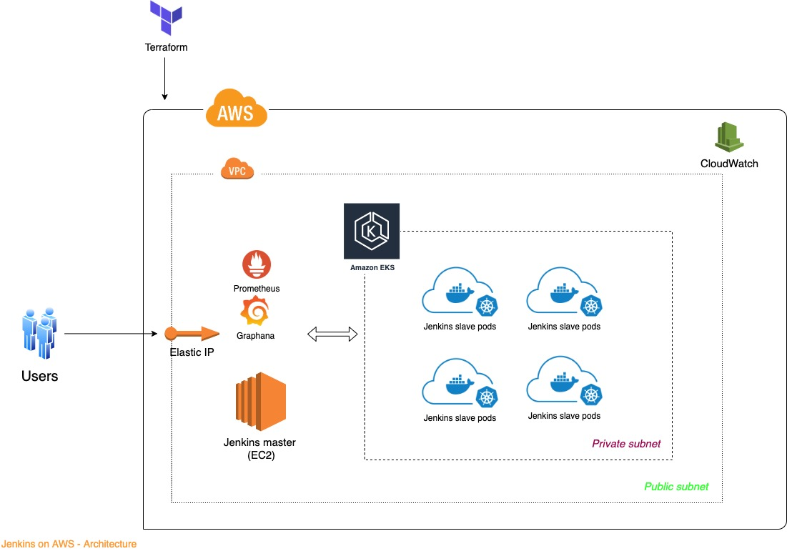

# Infrastructure setup for Jenkins on AWS

## Overview of steps

* Architecture of Jenkins on AWS
* Create Jenkins CI server using Terraform
* Create EKS cluster for provisioining Jenkins slaves using Terraform
* Configure Jenkins master to use EKS Cluster for creating worker nodes
* Create job to trigger pipeline from application repo using pod templates

## Architecture of Jenkins on AWS

